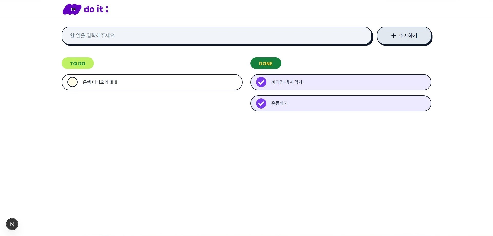
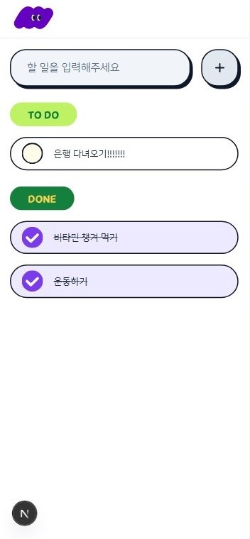
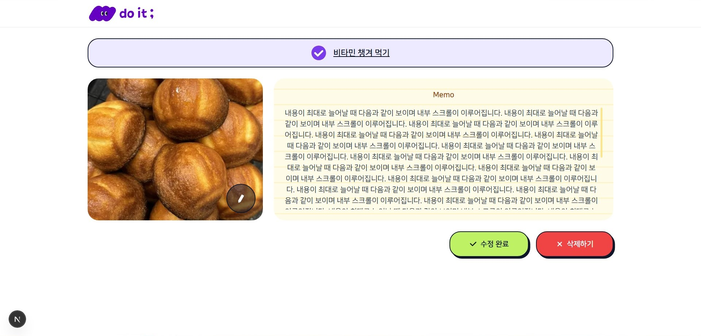

<p align="center">
  
</p>

<p align="center"><strong>할 일 목록을 관리하는 To Do 서비스</strong></p>

<p align="center">
  
  
  
  
</p>

---

## 🚀 기술 스택

- **Framework**: Next.js 15
- **Language**: TypeScript
- **Styling**: Tailwind CSS
- **Deployment**: Vercel

</br>

## ⚙️ 시작하기

### 1) 패키지 설치

```bash
npm install
```

### 2) 개발 서버 실행

```bash
npm run dev
```

브라우저에서 [http://localhost:3000](http://localhost:3000) 으로 접속

</br>

## ✨ 주요 기능

### 1) 할 일 목록 페이지

<div style="display: flex; gap: 20px;">
  
  
</div>

- 상단 `로고` 클릭 시 메인 페이지(`/`)로 이동 (새로고침)
- 상태별(진행 중 / 완료) 목록 조회 (`체크박스` 아이콘 클릭하여 상태 토글)
- **할 일 추가**: 상단 입력 창에 텍스트 입력 후 `추가하기` 버튼 클릭 혹은 `Enter` 키 타이핑하여 등록

### 2) 할 일 상세 페이지

<div style="display: flex; gap: 20px;">
  
  
</div>

- 목록에서 단일 항목 클릭 시 해당 항목의 상세 페이지로 이동
- **할 일 수정**:
  - 할 일의 이름 및 상태 수정
  - 메모 작성 및 이미지 첨부 가능 (영어 파일명, 5MB 이하)
  - `수정 완료` 버튼 클릭하여 변경 사항 저장 (`할 일 목록 페이지`로 이동)
- **할 일 삭제**: `삭제하기` 버튼 클릭하여 항목 제거 (`할 일 목록 페이지`로 이동)

### 3) 디바이스 최적화

- 반응형 웹 디자인 (모바일/ 태블릿/ 데스크탑)

</br>

## 🔗 배포

[do it ;](https://next-todo-list-virid.vercel.app/)
